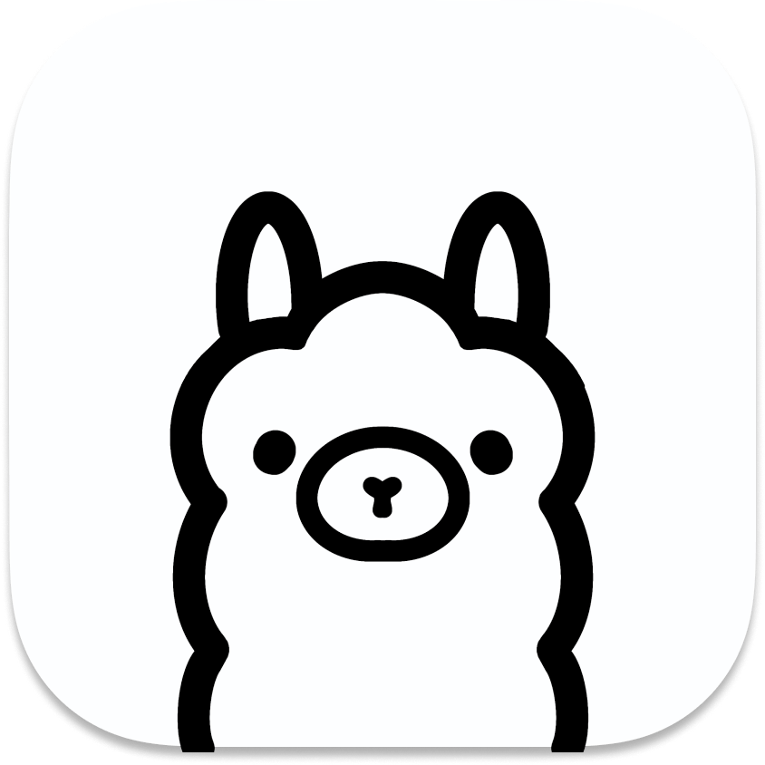

    
<a href="#"></a>

    <h1>Discord Ollama Integration</h1>
    <h3>Ollama as your Phone Chatbot</h3>

## About
Ollama is an AI model management tool that allows users to install and use custom large language models locally.

This project aims to:
* [ ] Create a phone service that will utilize Ollama and Interactive Voice Response (IVR) to chat with callers! 
  * [ ] Containerization with Docker
  * [ ] Administrator Role Compatible
* [ ] Allow others to create their own models personalized for their own purposes!
  * [ ] Documentation on creating your own LLM
  * [ ] Documentation on web scrapping and cleaning

## Inspiration
I give thanks to Jonathan Smoley and Kevin Dang for inspiring me to do this project.
It's the dedication and the project they've put into their Ollama project that encourages me to try something new.

You may view their project repository <a href="https://github.com/kevinthedang/discord-ollama/">here</a>.
